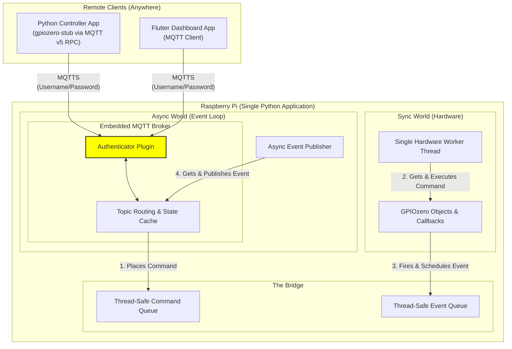

# Raspberry Pi GPIO Secure & Versatile Control System

## Project Summary
This project proposes a robust and secure architecture for controlling and monitoring Raspberry Pi GPIOs, designed for projects requiring multiple concurrent applications, remote access, and a rich user interface (like a Flutter dashboard). By leveraging a centralized Python "Gatekeeper" application that natively embeds an asynchronous MQTT v5 broker alongside `gpiozero` (configured with the modern `lgpio` pin factory), we create a flexible system that decouples hardware control from application logic. This allows for safe, real-time interaction with GPIOs across all modern Raspberry Pi models (including the Pi 5) without resource conflicts or security vulnerabilities, while preserving high-level command intent.

## The Core Problem & Our Journey Towards a Solution
Initially, the goal was to create a "versatile GPIO monitoring feature" for Raspberry Pi. This simple objective quickly exposed a series of fundamental challenges inherent in Raspberry Pi GPIO programming, pushing us to evolve our architectural approach:

### 1. The Challenge: Managing GPIO Access & Conflicts
The most immediate problem was how to safely monitor the same GPIO pins that another program controls. Different Python libraries offered conflicting behaviors:

*   **Direct Access Libraries (RPi.GPIO):** These older libraries allow multiple processes to directly manipulate physical hardware memory registers (`/dev/mem`). While seemingly flexible, this inevitably leads to unpredictable "glitches," severe race conditions, and even potential hardware damage due to conflicting commands. Monitoring via this method is unreliable and unsafe, as a monitor cannot safely observe or prevent another process's actions.
*   **Kernel-Managed Libraries (libgpiod / lgpio defaults):** These modern standard libraries enforce exclusive access via the Linux Kernel (`/dev/gpiochip`). This prevents conflicts but means only one process can "claim" a pin at a time. If a second process tries to access it, it results in a crash (`Device or resource busy`). This makes concurrent monitoring impossible, as a dedicated monitor process would constantly be blocked by the controlling application.

**The Crucial Insight:** We needed an underlying system that could mediate access, allowing a single authoritative entity to hold the hardware locks while providing reliable, non-conflicting event notifications to multiple network observers. 

### 2. The Solution's Foundation: Introducing the Central Gatekeeper & `lgpio`
To resolve the concurrency issues and ensure compatibility with modern hardware, we establish our own Python application as the **Central Gatekeeper**. 

Initially, we considered using the `pigpiod` daemon. However, `pigpio` relies on Broadcom-specific Direct Memory Access (DMA) hacks, rendering it fundamentally broken and incompatible with the Raspberry Pi 5's new RP1 architecture. Furthermore, introducing a separate C-based daemon added redundant overhead.

Instead, our Python Gatekeeper acts as the sole local application interacting with the GPIOs, utilizing the modern **`lgpio`** library. `lgpio` is the official standard for Raspberry Pi OS moving forward, interacting securely with the Linux kernel subsystem. It queues commands, executes them reliably, and detects input changes efficiently. This architecture inherently solves the concurrency problem, as multiple remote clients connect to the Gatekeeper without directly fighting for hardware access.

### 3. Securing Access: Preventing Circumvention via Kernel Locks
With our Gatekeeper now mediating all interactions, the next critical step was to ensure that all GPIO access flows exclusively through it. We wanted to prevent any other rogue local process from bypassing our Gatekeeper's safety checks or command processing.

**Our Solution:** By using `lgpio`, our Gatekeeper natively leverages **Linux Kernel Locking**. When the Gatekeeper initializes a pin, it asks the Linux kernel for exclusive access. The kernel grants it. If *any other* modern script on the Raspberry Pi tries to access that pin, the Linux kernel will actively block it and throw a `Device or resource busy (EBUSY)` error. 

**⚠️ Critical Security Concern regarding Legacy Libraries:**
While kernel locking protects against modern tools, **it does not protect against direct memory access**. Legacy libraries like `RPi.GPIO` bypass the Linux kernel entirely and write directly to RAM. If a rogue or poorly configured script running on the Pi uses `RPi.GPIO`, it can circumvent our broker's kernel locks and forcefully change pin states, leading to unpredictable hardware behavior. Therefore, system administrators must ensure legacy libraries are not deployed alongside this system or optionally:

- create a specific Linux user for the broker (e.g., gpio_broker_user).
- and write a simple Linux udev rule that tells the operating system: "When the Pi boots up, change the owner of /dev/gpiochip* to gpio_broker_user, and remove read/write access for everyone else."

### 4. Abstraction & Intent Preservation: Addressing the Hardware Interface
Having established secure, kernel-level hardware control, we needed our Gatekeeper to translate raw hardware interactions into high-level, application-specific concepts.

To achieve this, our Gatekeeper leverages the **`gpiozero`** library directly. `gpiozero` acts as an abstraction layer itself. By explicitly configuring `gpiozero` within our Gatekeeper to use the `lgpio` pin factory (gpiozero also could use other libraries like rpi.gpio), we combine `gpiozero`'s high-level API with secure, modern kernel access.

This strategic integration provides critical advantages:
*   **High-Level API:** The Gatekeeper uses an intuitive, object-oriented API (e.g., `LED(17)`, `Button(27)`, `Motor()`), translating high-level concepts (`led.on()`) into the appropriate low-level system calls. This allows our system to understand and process the intent behind an action rather than just a raw pin manipulation, which is vital for logging and status displays.
*   **Advanced Event Handling:** `gpiozero` transparently handles complexities like button debouncing and provides convenient `when_pressed` callbacks. This transforms raw kernel interrupts into reliable, high-level events that our Gatekeeper can process.

### 5. The Protocol Problem: Deciding How to Communicate
With the Gatekeeper holding the hardware, we needed a robust network protocol to expose this to remote dashboards (like Flutter) and remote Python scripts. 

*   **Attempt 1: Custom WebSockets (FastAPI).** We initially designed a unified WebSocket API. However, this required us to invent our own JSON protocol from scratch. We would have to manually write complex algorithms for State Caching (to give new clients the current hardware state) and Disconnect-Safety (to turn off motors if a client crashed).
*   **Attempt 2: WAMP (Web Application Messaging Protocol).** WAMP brilliantly solves the issue by supporting both Pub/Sub (for events) and RPC (for commands). However, WAMP requires running an external router daemon (like Crossbar.io) alongside our app.
*   **The Final Decision: Embedded MQTT v5.** We pivoted to embedding an asynchronous Python MQTT broker directly inside our Gatekeeper application.

By utilizing an **Embedded MQTT Broker**, we achieve a perfect, self-contained IoT ecosystem:
1.  **A Well-Defined Standard:** MQTT is known throughout the IoT scene. By using it, we do not have to invent a protocol. We use standard topics (e.g., `pi/gpio/17/set`, `pi/gpio/17/state`), allowing our Gatekeeper to be controlled by our Flutter app, our Python Stub, or any existing third-party MQTT device (like Home Assistant).
2.  **No External Dependencies:** By embedding a Python-native broker, we do not depend on non-Python code, nor do we need to install separate pieces of infrastructure like Mosquitto or Crossbar.io.
3.  **The "Digital Twin" (Free State Caching):** MQTT natively supports "Retained Messages." When the Gatekeeper changes a pin state, it publishes it as retained. When a Flutter app connects hours later, the broker instantly pushes the current hardware state to the UI.
4.  **Preserving Object Intent (MQTT v5 RPC):** Standard MQTT is "fire-and-forget", which ruins the object-oriented feel of a Python stub (e.g., `remote_led.on()` wouldn't know if it succeeded). However, by specifically utilizing **MQTT v5**, we leverage its native **Request/Response (RPC)** capabilities. Our Python stub attaches a "Response Topic" and "Correlation Data" to its command, allowing `remote_led.on()` to wait for a definitive success/fail confirmation from the Pi.

### 6. The Implementation: Bridging the Sync/Async Divide

With the architecture defined, the most critical implementation challenge is to safely connect the two disparate concurrency models within our single Python application:
*   The **Asynchronous Network Layer** (the embedded `asyncio` MQTT broker).
*   The **Synchronous Hardware Layer** (`gpiozero`, which uses standard, blocking threads).

Directly connecting these would cause the network to freeze or the application to crash. To prevent this, we implement a robust **Command & Event Queue** pattern, creating a thread-safe bridge that completely decouples the two worlds.

#### The Bridge Architecture: A Central `HardwareManager`
We create a central class that manages two dedicated, one-way queues:
1.  **A `Command Queue`:** For sending instructions *from* the network *to* the hardware.
2.  **An `Event Queue`:** For sending notifications *from* the hardware *back to* the network.

#### The Inbound Path (Async -> Sync): Guaranteeing Command Integrity
To ensure MQTT commands are executed in the correct order without interrupting each other (e.g., preventing a `motor.forward()` and `motor.stop()` from running simultaneously), we use a single worker thread.

1.  **Enqueue:** When an `async` MQTT handler receives a command, it does not execute it. It simply formats the command as a data object and places it onto the `Command Queue`. This is an instantaneous, non-blocking action.
2.  **Dequeue & Execute:** A single, dedicated **Hardware Worker Thread** runs a simple `while True` loop. Its only job is to pull one command at a time from the queue. Because there is only one worker, commands are processed sequentially (First-In, First-Out), guaranteeing order and preventing hardware race conditions.

#### The Outbound Path (Sync -> Async): The "Service Window" for Events
Hardware interrupts (like a button press) feel asynchronous, but `gpiozero` fires their callbacks in standard OS threads, which are completely unaware of the `asyncio` event loop. A direct call from this thread to an `async` MQTT function would corrupt the event loop's state and crash the program.

To mitigate this, we use a thread-safe "service window" to pass the event data safely:
1.  **Event Fires:** A `gpiozero` event (e.g., `when_pressed`) triggers its callback function in a standard background thread.
2.  **Safe Scheduling:** This callback does not attempt to publish the MQTT message directly. Instead, it uses `loop.call_soon_threadsafe()`. This function acts as a secure airlock, handing off the event data and the action to be performed (placing the data on the `Event Queue`) to the main `asyncio` loop.
3.  **Dequeue & Publish:** A dedicated `async` task constantly monitors the `Event Queue`. When data arrives, this task safely pulls it and publishes it to the MQTT broker.

This pattern ensures that the `asyncio` event loop is never blocked by hardware operations, and that hardware threads never directly interfere with the event loop's state, resulting in a highly responsive and stable application.

### 7. Securing the Broker: Authentication
With a functional network and hardware bridge, the next critical step is to secure the system's perimeter. By default, an MQTT broker is open, allowing any client on the network to connect, publish, and subscribe freely. Our architecture addresses this by implementing a robust, self-contained authentication layer.

**The Solution: Embedded Authenticator Plugin**
Rather than relying on external password files (as a standalone broker like Mosquitto would), we leverage the plugin system of our embedded Python MQTT broker. This allows us to define authentication logic directly within our Gatekeeper application.

1.  **Standard Protocol:** We use the MQTT protocol's standard `username` and `password` fields. This ensures that any compliant client (our Flutter app, Python stub, etc.) can connect securely without needing custom logic.
2.  **Secure Credential Storage:** User passwords are not stored in plain text. They are securely hashed (e.g., using `passlib` or `werkzeug.security`) and stored within the application's configuration.
3.  **Custom Authenticator:** A custom Python class acts as an "authenticator hook." For every incoming connection request, the embedded broker calls this class to validate the provided credentials against the stored hashes before allowing the connection.
4.  **Encryption (TLS):** For production environments, the entire MQTT session is encrypted using TLS (MQTTS). This prevents credentials from being intercepted on the network.

This approach provides a strong security foundation, ensuring that only known and authorized clients can interact with the system.

**Future Work: Authorization (Access Control Lists)**
Currently, any authenticated user has full permission to publish and subscribe to all topics. A future enhancement will be to implement Authorization via Access Control Lists (ACLs). This will allow for fine-grained control, for example, creating "read-only" guest users who can subscribe to sensor data but are forbidden from publishing commands to control hardware.


### 8. Operational Safety - The Multiple Writers Risk

The Flaw: By design, our MQTT broker (even with authentication) will happily accept valid commands from any connected and authenticated client. Our HardwareManager's Command Queue will then dutifully execute these commands in the order they arrive. This creates an Operational Safety Risk where conflicting commands can be sent to the same physical hardware almost simultaneously.

The Scenario:

    Authenticated User A (via a Flutter app) sends an MQTT v5 RPC command to lower a motorized projector screen. This command is placed in the Command Queue and begins executing.

    A split second later, Authenticated User B (via a Python stub), unaware of User A's action, sends an MQTT v5 RPC command to raise the projector screen.

    The Result: The raise command is placed in the Command Queue right after the lower command. As soon as the lower sequence finishes (or even if it's interrupted by a subsequent command to reverse direction), the raise command will execute. This could send conflicting electrical signals to the motor controller, potentially stripping gears, blowing fuses, damaging the hardware, or creating a physical safety hazard.

Our system currently has no logical concept of "who is currently in control" of a specific piece of hardware. It's an "open free-for-all" for authenticated users, which is acceptable for simple lights but dangerous for motors or critical actuators.

To address this, we need to introduce a "Control Lease" or "Writer Lock" Manager within our Python Gatekeeper application. This mechanism will ensure that a specific piece of hardware (or the entire system) can only receive "write" commands from one designated client at a time, while all other authenticated clients are temporarily in a "read-only" mode for that resource.

This can be done global as in "one lock for all pin's" or "per resource/pin". For now a global lock will be sufficient, but later we can refactor towards a more versatile solution.

## The Evolved Solution: A Secure Gatekeeper Architecture
Our solution is a centralized, self-contained Python application that acts as the sole Gatekeeper and communication hub for all GPIO interactions.

### Architecture Diagram


### Key Components:
*   **The Single Python Application:** The central nervous system of our GPIO system, containing both the network layer and hardware layer in one deployable script.
*   **Embedded MQTT Broker:** Listens for connections, manages the state cache (Retained Messages), handles Disconnect-Safety (Last Will and Testament), and routes messages.
*   **Hardware Translation Daemon:** Uses `gpiozero` configured for `lgpio` to securely claim pins from the Linux kernel. It actively translates incoming MQTT commands into physical actions, and broadcasts unsolicited physical events (like button presses) out to the MQTT broker.
*   **gpiozero Stub Wrapper (For Controller Apps):** A small Python library that mimics the `gpiozero` API (e.g., `RemoteLED`). When a script calls `remote_led.on()`, the stub serializes the command and utilizes MQTT v5's RPC Request/Response feature to ensure the hardware action was successfully completed over the network.
*   **Flutter Dashboard (The UI):** A real-time user interface utilizing standard, battle-tested MQTT client libraries to monitor the Digital Twin state and send commands.

## Why This Architecture Solves Our Problems
*   **Concurrency:** The Gatekeeper handles all hardware access locally, ensuring no conflicts. All other applications connect safely via standard MQTT.
*   **Hardware Diversity:** The system uses `lgpio`, natively supporting the RP1 chip in the Raspberry Pi 5, as well as legacy Broadcom SoCs.
*   **Security:** The Linux kernel locks the GPIOs down to our specific application.
*   **Abstraction & Intent:** Controller apps use a familiar `gpiozero`-like API powered by MQTT v5 RPC, preserving synchronous error handling and semantic intent.
*   **Zero External Dependencies:** By embedding the broker, we avoid installing third-party daemons (Mosquitto/Crossbar), keeping deployment simple.

## What We Explicitly Excluded (and Why)
*   **`pigpiod` / `pigpio`:** Excluded because its DMA-based approach is fundamentally incompatible with the Raspberry Pi 5. Furthermore, our Gatekeeper architecture makes a separate background hardware daemon redundant.
*   **RPi.GPIO:** Excluded early due to its legacy status, direct memory access leading to hardware conflicts, and its dangerous ability to bypass Linux kernel locks.
*   **WebIOPi:** Excluded due to its obsolescence (Python 2), lack of maintenance, and monolithic design.
*   **External MQTT Brokers (Mosquitto) / WAMP Routers (Crossbar.io):** Excluded because requiring users to install and configure non-Python background services heavily complicates deployment.
*   **Custom WebSockets (FastAPI):** Excluded because building a custom network protocol forces us to reinvent standard IoT features (like state caching, routing, and disconnect safety) that MQTT provides natively out of the box. 

## Project Structure

To ensure this project can be easily distributed as a reusable Python package (e.g., via PyPI) and imported into other projects, we will use a standard modern Python package layout (using `pyproject.toml` and `src/` directory structure).

We separate the codebase into `server` (the Gatekeeper running on the Pi) and `client` (the stub used by remote scripts).

```text
pi-mqtt-gpio/
├── [ ] pyproject.toml               # Build system, dependencies, and project metadata
├── [ ] README.md                    # Project documentation
├── src/
│   └── pi_mqtt_gpio/
│       ├── [ ] __init__.py
│       ├── server/              # Code that runs ON the Raspberry Pi
│       │   ├── [ ] __init__.py
│       │   ├── [ ] main.py          # CLI entry point to start the daemon
│       │   ├── [ ] broker.py        # Embedded amqtt broker setup & config
│       │   ├── [ ] hardware.py      # HardwareManager, Sync/Async Bridge, Worker Thread
│       │   ├── [ ] security.py      # Authenticator Plugin & Control Lease Manager
│       │   └── [ ] rpc_handler.py   # Decodes MQTT v5 payloads into hardware commands
│       └── client/              # Code that runs on REMOTE machines (The Stub)
│           ├── [ ] __init__.py
│           ├── [ ] connection.py    # MQTT v5 Client wrapper (paho-mqtt)
│           └── [ ] devices.py       # RemoteLED, RemoteButton, etc.
└── tests/
    ├── [ ] __init__.py
    ├── [ ] conftest.py              # Pytest fixtures (e.g., mocking gpiozero hardware)
    ├── [ ] test_server_hardware.py
    ├── [ ] test_server_security.py
    └── [ ] test_client_stub.py
```

---

## Development Workplan & Roadmap

This project follows a **Test-Driven Development (TDD)** approach. For each step, the tests are written *before* the implementation. Since this code interacts with hardware, the tests will heavily rely on mocking the `gpiozero` library so they can run on any development machine (not just a Raspberry Pi).

### Phase 1: Project Skeleton & Tooling `v0.1.0`
- [X] Create a virtual environment, project skeleton
- [X] Create a python package including toml file installing core dependencies `amqtt`, `paho-mqtt` for raspberry only: `gpiozero`, `lgpio`, and for development: `pytest`
- [X] Create a test checking wether importing this packages `pi_mqtt_gpio.server` and `pi_mqtt_gpio.client` works

### Phase 2: The Core Bridge (Sync/Async) `v0.2.0`
- [X] Implement `HardwareManager` to bridge asynchronous network traffic with synchronous hardware operations
- [X] Implement the **Inbound Path**: A thread-safe `queue.Queue` and a dedicated worker thread to execute commands sequentially
- [X] Implement the **Outbound Path**: An `asyncio.Queue` and `loop.call_soon_threadsafe` logic to push hardware interrupts back to the main loop
- [X] Verify functionality with `tests/server/test_hardware.py` using `gpiozero`'s `MockFactory`

### Phase 3: Embedded Broker & RPC Decoding `v0.3.0`
- [ ] **Test (RPC Router):** Pass a mock JSON payload (`{"device": "led1", "method": "on"}`) to the RPC handler. Assert it correctly identifies the target object and formats it for the `HardwareManager`'s Command Queue.
- [ ] **Implementation:** Write `server/broker.py` to instantiate the `amqtt` broker inside an asyncio loop. Write `server/rpc_handler.py` to subscribe to the command topic, parse incoming JSON, and pass it to the bridge. Connect the `Event Queue` to publish outgoing messages.
- [ ] **Commit:** `feat: embed amqtt broker and route rpc commands to hardware bridge (v0.3.0)`

### Phase 4: The Remote Client Stub `v0.4.0`
- [ ] **Test (Stub Command):** Mock the `paho-mqtt` network layer. Call `remote_led.on()`. Assert that the stub generates a correct MQTT v5 JSON payload containing a unique correlation ID and response topic.
- [ ] **Implementation:** Write `client/connection.py` (handling the MQTT v5 connection and response correlation) and `client/devices.py` (creating the `RemoteLED` wrapper that mimics `gpiozero` syntax).
- [ ] **Commit:** `feat: create python client stub with mqtt v5 rpc capabilities (v0.4.0)`

### Phase 5: Security Layer (Authentication) `v0.5.0`
- [ ] **Test (Auth Logic):** Write unit tests for the Authenticator class. Pass valid credentials -> assert `True`. Pass invalid credentials -> assert `False`.
- [ ] **Implementation:** Write the custom `amqtt` Authenticator plugin in `server/security.py`. Hardcode a hashed password for MVP testing. Inject this plugin into the broker configuration.
- [ ] **Commit:** `feat: implement embedded broker authentication plugin (v0.5.0)`

### Phase 6: Operational Safety (Control Leases) `v0.6.0`
- [ ] **Test (Lease Grant):** Request lease -> assert granted. 
- [ ] **Test (Lease Denial):** Client A holds lease. Client B requests lease -> assert denied.
- [ ] **Test (Lease Timeout):** Client A holds lease. Fast-forward mock time by 60 seconds. Assert lease is revoked and safety hardware shutdown commands are placed in the `Command Queue`.
- [ ] **Implementation:** Implement `ControlLeaseManager` in `server/security.py`. Intercept all inbound RPC write commands in `rpc_handler.py` and verify the sender holds the lease before placing the command in the queue.
- [ ] **Commit:** `feat: implement control lease manager to prevent multiple writers (v0.6.0)`

### Phase 7: Configuration & Packaging (MVP Release) `v1.0.0`
- [ ] **Test (Config Loading):** Provide a mock `config.yaml` file (containing pin definitions and hashed passwords). Assert the server parses it correctly and initializes the correct `gpiozero` objects.
- [ ] **Implementation:** Add a configuration parser (e.g., using `PyYAML` or `toml`). Create the `main.py` entry point so the server can be started via a CLI command (e.g., `pi-mqtt-gatekeeper --config /etc/pi-mqtt.yaml`).
- [ ] **Commit:** `feat: add configuration file parsing and CLI entry point (v1.0.0)`

