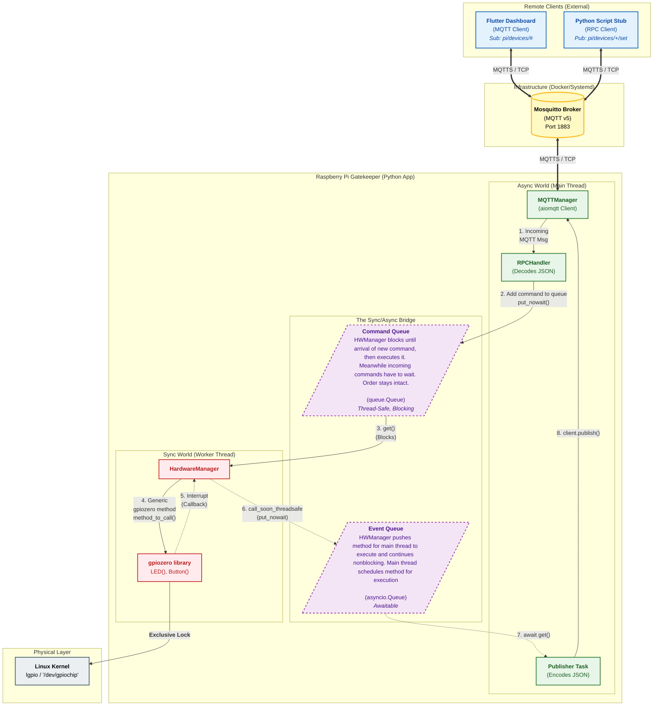
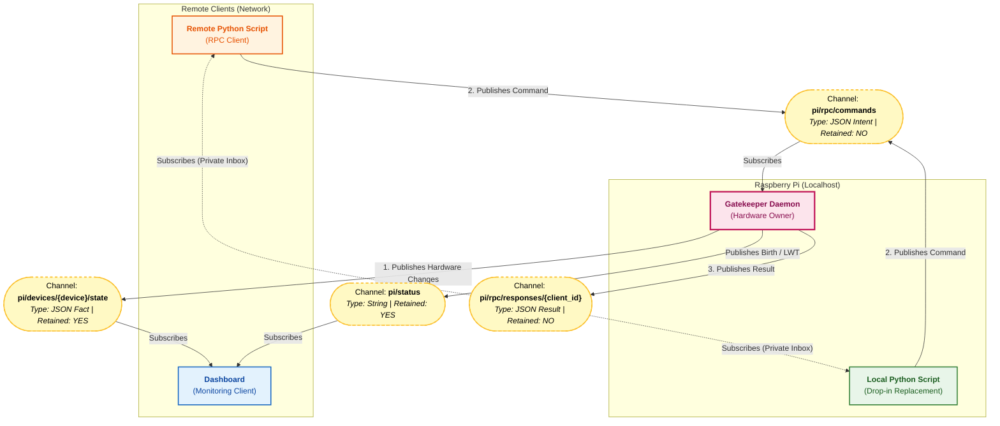

# Raspberry Pi GPIO Secure & Versatile Control System

## Project Summary
This project proposes a robust and secure architecture for controlling and monitoring Raspberry Pi GPIOs, designed for projects requiring multiple concurrent applications, remote access, and a rich user interface (like a Flutter dashboard). By leveraging a centralized Python "Gatekeeper" application that natively embeds an asynchronous MQTT v5 broker alongside `gpiozero` (configured with the modern `lgpio` pin factory), we create a flexible system that decouples hardware control from application logic. This allows for safe, real-time interaction with GPIOs across all modern Raspberry Pi models (including the Pi 5) without resource conflicts or security vulnerabilities, while preserving high-level command intent.

## The Core Problem & Our Journey Towards a Solution
Initially, the goal was to create a "versatile GPIO monitoring feature" for Raspberry Pi. This simple objective quickly exposed a series of fundamental challenges inherent in Raspberry Pi GPIO programming, pushing us to evolve our architectural approach:

### 1. The Challenge: Managing GPIO Access & Conflicts
The most immediate problem was how to safely monitor the same GPIO pins that another program controls. Different Python libraries offered conflicting behaviors:

*   **Direct Access Libraries (RPi.GPIO):** These older libraries allow multiple processes to directly manipulate physical hardware memory registers (`/dev/mem`). While seemingly flexible, this inevitably leads to unpredictable "glitches," severe race conditions, and even potential hardware damage due to conflicting commands. Monitoring via this method is unreliable and unsafe, as a monitor cannot safely observe or prevent another process's actions.
*   **Kernel-Managed Libraries (libgpiod / lgpio defaults):** These modern standard libraries enforce exclusive access via the Linux Kernel (`/dev/gpiochip`). This prevents conflicts but means only one process can "claim" a pin at a time. If a second process tries to access it, it results in a crash (`Device or resource busy`). This makes concurrent monitoring impossible, as a dedicated monitor process would constantly be blocked by the controlling application.

**The Crucial Insight:** We needed an underlying system that could mediate access, allowing a single authoritative entity to hold the hardware locks while providing reliable, non-conflicting event notifications to multiple network observers. 

### 2. The Solution's Foundation: Introducing the Central Gatekeeper & `lgpio`
To resolve the concurrency issues and ensure compatibility with modern hardware, we establish our own Python application as the **Central Gatekeeper**. 

Initially, we considered using the `pigpiod` daemon. However, `pigpio` relies on Broadcom-specific Direct Memory Access (DMA) hacks, rendering it fundamentally broken and incompatible with the Raspberry Pi 5's new RP1 architecture. Furthermore, introducing a separate C-based daemon added redundant overhead.

Instead, our Python Gatekeeper acts as the sole local application interacting with the GPIOs, utilizing the modern **`lgpio`** library. `lgpio` is the official standard for Raspberry Pi OS moving forward, interacting securely with the Linux kernel subsystem. It queues commands, executes them reliably, and detects input changes efficiently. This architecture inherently solves the concurrency problem, as multiple remote clients connect to the Gatekeeper without directly fighting for hardware access.

### 3. Securing Access: Preventing Circumvention via Kernel Locks
With our Gatekeeper now mediating all interactions, the next critical step was to ensure that all GPIO access flows exclusively through it. We wanted to prevent any other rogue local process from bypassing our Gatekeeper's safety checks or command processing.

**Our Solution:** By using `lgpio`, our Gatekeeper natively leverages **Linux Kernel Locking**. When the Gatekeeper initializes a pin, it asks the Linux kernel for exclusive access. The kernel grants it. If *any other* modern script on the Raspberry Pi tries to access that pin, the Linux kernel will actively block it and throw a `Device or resource busy (EBUSY)` error. 

**⚠️ Critical Security Concern regarding Legacy Libraries:**
While kernel locking protects against modern tools, **it does not protect against direct memory access**. Legacy libraries like `RPi.GPIO` bypass the Linux kernel entirely and write directly to RAM. If a rogue or poorly configured script running on the Pi uses `RPi.GPIO`, it can circumvent our broker's kernel locks and forcefully change pin states, leading to unpredictable hardware behavior. Therefore, system administrators must ensure legacy libraries are not deployed alongside this system or optionally:

- create a specific Linux user for the broker (e.g., gpio_broker_user).
- and write a simple Linux udev rule that tells the operating system: "When the Pi boots up, change the owner of /dev/gpiochip* to gpio_broker_user, and remove read/write access for everyone else."

### 4. Abstraction & Intent Preservation: Addressing the Hardware Interface
Having established secure, kernel-level hardware control, we needed our Gatekeeper to translate raw hardware interactions into high-level, application-specific concepts.

To achieve this, our Gatekeeper leverages the **`gpiozero`** library directly. `gpiozero` acts as an abstraction layer itself. By explicitly configuring `gpiozero` within our Gatekeeper to use the `lgpio` pin factory (gpiozero also could use other libraries like rpi.gpio), we combine `gpiozero`'s high-level API with secure, modern kernel access.

This strategic integration provides critical advantages:
*   **High-Level API:** The Gatekeeper uses an intuitive, object-oriented API (e.g., `LED(17)`, `Button(27)`, `Motor()`), translating high-level concepts (`led.on()`) into the appropriate low-level system calls. This allows our system to understand and process the intent behind an action rather than just a raw pin manipulation, which is vital for logging and status displays.
*   **Advanced Event Handling:** `gpiozero` transparently handles complexities like button debouncing and provides convenient `when_pressed` callbacks. This transforms raw kernel interrupts into reliable, high-level events that our Gatekeeper can process.

### 5. The Protocol Problem: Deciding How to Communicate
With the Gatekeeper holding the hardware, we needed a robust network protocol to expose this to remote dashboards (like Flutter) and remote Python scripts. 

*   **Attempt 1: Custom WebSockets (FastAPI).** We initially designed a unified WebSocket API. However, this required us to invent our own JSON protocol from scratch. We would have to manually write complex algorithms for State Caching (to give new clients the current hardware state) and Disconnect-Safety (to turn off motors if a client crashed).
*   **Attempt 2: WAMP (Web Application Messaging Protocol).** WAMP brilliantly solves the issue by supporting both Pub/Sub (for events) and RPC (for commands). However, WAMP requires running an external router daemon (like Crossbar.io) alongside our app.
*   **The Final Decision: Embedded MQTT v5.** We pivoted to embedding an asynchronous Python MQTT broker directly inside our Gatekeeper application.

By utilizing an **Embedded MQTT Broker**, we achieve a perfect, self-contained IoT ecosystem:
1.  **A Well-Defined Standard:** MQTT is known throughout the IoT scene. By using it, we do not have to invent a protocol. We use standard topics (e.g., `pi/gpio/17/set`, `pi/gpio/17/state`), allowing our Gatekeeper to be controlled by our Flutter app, our Python Stub, or any existing third-party MQTT device (like Home Assistant).
2.  **No External Dependencies:** By embedding a Python-native broker, we do not depend on non-Python code, nor do we need to install separate pieces of infrastructure like Mosquitto or Crossbar.io.
3.  **The "Digital Twin" (Free State Caching):** MQTT natively supports "Retained Messages." When the Gatekeeper changes a pin state, it publishes it as retained. When a Flutter app connects hours later, the broker instantly pushes the current hardware state to the UI.
4.  **Preserving Object Intent (MQTT v5 RPC):** Standard MQTT is "fire-and-forget", which ruins the object-oriented feel of a Python stub (e.g., `remote_led.on()` wouldn't know if it succeeded). However, by specifically utilizing **MQTT v5**, we leverage its native **Request/Response (RPC)** capabilities. Our Python stub attaches a "Response Topic" and "Correlation Data" to its command, allowing `remote_led.on()` to wait for a definitive success/fail confirmation from the Pi.

### 6. The Implementation: Bridging the Sync/Async Divide

With the architecture defined, the most critical implementation challenge is to safely connect the two disparate concurrency models within our single Python application:
*   The **Asynchronous Network Layer** (the embedded `asyncio` MQTT broker).
*   The **Synchronous Hardware Layer** (`gpiozero`, which uses standard, blocking threads).

Directly connecting these would cause the network to freeze or the application to crash. To prevent this, we implement a robust **Command & Event Queue** pattern, creating a thread-safe bridge that completely decouples the two worlds.

#### The Bridge Architecture: A Central `HardwareManager`
We create a central class that manages two dedicated, one-way queues:
1.  **A `Command Queue`:** For sending instructions *from* the network *to* the hardware.
2.  **An `Event Queue`:** For sending notifications *from* the hardware *back to* the network.

#### The Inbound Path (Async -> Sync): Guaranteeing Command Integrity
To ensure MQTT commands are executed in the correct order without interrupting each other (e.g., preventing a `motor.forward()` and `motor.stop()` from running simultaneously), we use a single worker thread.

1.  **Enqueue:** When an `async` MQTT handler receives a command, it does not execute it. It simply formats the command as a data object and places it onto the `Command Queue`. This is an instantaneous, non-blocking action.
2.  **Dequeue & Execute:** A single, dedicated **Hardware Worker Thread** runs a simple `while True` loop. Its only job is to pull one command at a time from the queue. Because there is only one worker, commands are processed sequentially (First-In, First-Out), guaranteeing order and preventing hardware race conditions.

#### The Outbound Path (Sync -> Async): The "Service Window" for Events
Hardware interrupts (like a button press) feel asynchronous, but `gpiozero` fires their callbacks in standard OS threads, which are completely unaware of the `asyncio` event loop. A direct call from this thread to an `async` MQTT function would corrupt the event loop's state and crash the program.

To mitigate this, we use a thread-safe "service window" to pass the event data safely:
1.  **Event Fires:** A `gpiozero` event (e.g., `when_pressed`) triggers its callback function in a standard background thread.
2.  **Safe Scheduling:** This callback does not attempt to publish the MQTT message directly. Instead, it uses `loop.call_soon_threadsafe()`. This function acts as a secure airlock, handing off the event data and the action to be performed (placing the data on the `Event Queue`) to the main `asyncio` loop.
3.  **Dequeue & Publish:** A dedicated `async` task constantly monitors the `Event Queue`. When data arrives, this task safely pulls it and publishes it to the MQTT broker.

This pattern ensures that the `asyncio` event loop is never blocked by hardware operations, and that hardware threads never directly interfere with the event loop's state, resulting in a highly responsive and stable application.

### 7. Securing the Broker: Authentication
With a functional network and hardware bridge, the next critical step is to secure the system's perimeter. By default, an MQTT broker is open, allowing any client on the network to connect, publish, and subscribe freely. Our architecture addresses this by implementing a robust, self-contained authentication layer.

**The Solution: Embedded Authenticator Plugin**
Rather than relying on external password files (as a standalone broker like Mosquitto would), we leverage the plugin system of our embedded Python MQTT broker. This allows us to define authentication logic directly within our Gatekeeper application.

1.  **Standard Protocol:** We use the MQTT protocol's standard `username` and `password` fields. This ensures that any compliant client (our Flutter app, Python stub, etc.) can connect securely without needing custom logic.
2.  **Secure Credential Storage:** User passwords are not stored in plain text. They are securely hashed (e.g., using `passlib` or `werkzeug.security`) and stored within the application's configuration.
3.  **Custom Authenticator:** A custom Python class acts as an "authenticator hook." For every incoming connection request, the embedded broker calls this class to validate the provided credentials against the stored hashes before allowing the connection.
4.  **Encryption (TLS):** For production environments, the entire MQTT session is encrypted using TLS (MQTTS). This prevents credentials from being intercepted on the network.

This approach provides a strong security foundation, ensuring that only known and authorized clients can interact with the system.

**Future Work: Authorization (Access Control Lists)**
Currently, any authenticated user has full permission to publish and subscribe to all topics. A future enhancement will be to implement Authorization via Access Control Lists (ACLs). This will allow for fine-grained control, for example, creating "read-only" guest users who can subscribe to sensor data but are forbidden from publishing commands to control hardware.


### 8. Operational Safety - The Multiple Writers Risk

The Flaw: By design, our MQTT broker (even with authentication) will happily accept valid commands from any connected and authenticated client. Our HardwareManager's Command Queue will then dutifully execute these commands in the order they arrive. This creates an Operational Safety Risk where conflicting commands can be sent to the same physical hardware almost simultaneously.

The Scenario:

    Authenticated User A (via a Flutter app) sends an MQTT v5 RPC command to lower a motorized projector screen. This command is placed in the Command Queue and begins executing.

    A split second later, Authenticated User B (via a Python stub), unaware of User A's action, sends an MQTT v5 RPC command to raise the projector screen.

    The Result: The raise command is placed in the Command Queue right after the lower command. As soon as the lower sequence finishes (or even if it's interrupted by a subsequent command to reverse direction), the raise command will execute. This could send conflicting electrical signals to the motor controller, potentially stripping gears, blowing fuses, damaging the hardware, or creating a physical safety hazard.

Our system currently has no logical concept of "who is currently in control" of a specific piece of hardware. It's an "open free-for-all" for authenticated users, which is acceptable for simple lights but dangerous for motors or critical actuators.

To address this, we need to introduce a "Control Lease" or "Writer Lock" Manager within our Python Gatekeeper application. This mechanism will ensure that a specific piece of hardware (or the entire system) can only receive "write" commands from one designated client at a time, while all other authenticated clients are temporarily in a "read-only" mode for that resource.

This can be done global as in "one lock for all pin's" or "per resource/pin". For now a global lock will be sufficient, but later we can refactor towards a more versatile solution.

## The Evolved Solution: A Secure Gatekeeper Architecture
Our solution is a centralized, self-contained Python application that acts as the sole Gatekeeper and communication hub for all GPIO interactions.

### Architecture Diagram


### Key Components:
*   **The Single Python Application:** The central nervous system of our GPIO system, containing both the network layer and hardware layer in one deployable script.
*   **Embedded MQTT Broker:** Listens for connections, manages the state cache (Retained Messages), handles Disconnect-Safety (Last Will and Testament), and routes messages.
*   **Hardware Translation Daemon:** Uses `gpiozero` configured for `lgpio` to securely claim pins from the Linux kernel. It actively translates incoming MQTT commands into physical actions, and broadcasts unsolicited physical events (like button presses) out to the MQTT broker.
*   **gpiozero Stub Wrapper (For Controller Apps):** A small Python library that mimics the `gpiozero` API (e.g., `RemoteLED`). When a script calls `remote_led.on()`, the stub serializes the command and utilizes MQTT v5's RPC Request/Response feature to ensure the hardware action was successfully completed over the network.
*   **Flutter Dashboard (The UI):** A real-time user interface utilizing standard, battle-tested MQTT client libraries to monitor the Digital Twin state and send commands.

## Why This Architecture Solves Our Problems
*   **Concurrency:** The Gatekeeper handles all hardware access locally, ensuring no conflicts. All other applications connect safely via standard MQTT.
*   **Hardware Diversity:** The system uses `lgpio`, natively supporting the RP1 chip in the Raspberry Pi 5, as well as legacy Broadcom SoCs.
*   **Security:** The Linux kernel locks the GPIOs down to our specific application.
*   **Abstraction & Intent:** Controller apps use a familiar `gpiozero`-like API powered by MQTT v5 RPC, preserving synchronous error handling and semantic intent.
*   **Zero External Dependencies:** By embedding the broker, we avoid installing third-party daemons (Mosquitto/Crossbar), keeping deployment simple.

## What We Explicitly Excluded (and Why)
*   **`pigpiod` / `pigpio`:** Excluded because its DMA-based approach is fundamentally incompatible with the Raspberry Pi 5. Furthermore, our Gatekeeper architecture makes a separate background hardware daemon redundant.
*   **RPi.GPIO:** Excluded early due to its legacy status, direct memory access leading to hardware conflicts, and its dangerous ability to bypass Linux kernel locks.
*   **WebIOPi:** Excluded due to its obsolescence (Python 2), lack of maintenance, and monolithic design.
*   **External MQTT Brokers (Mosquitto) / WAMP Routers (Crossbar.io):** Excluded because requiring users to install and configure non-Python background services heavily complicates deployment.
*   **Custom WebSockets (FastAPI):** Excluded because building a custom network protocol forces us to reinvent standard IoT features (like state caching, routing, and disconnect safety) that MQTT provides natively out of the box. 

## Project Structure

To ensure this project can be easily distributed as a reusable Python package (e.g., via PyPI) and imported into other projects, we will use a standard modern Python package layout (using `pyproject.toml` and `src/` directory structure).

We separate the codebase into `server` (the Gatekeeper running on the Pi) and `client` (the stub used by remote scripts).

```text
pi-mqtt-gpio/
├── [ ] pyproject.toml               # Build system, dependencies, and project metadata
├── [ ] README.md                    # Project documentation
├── src/
│   └── pi_mqtt_gpio/
│       ├── [ ] __init__.py
│       ├── server/              # Code that runs ON the Raspberry Pi
│       │   ├── [ ] __init__.py
│       │   ├── [ ] main.py          # CLI entry point to start the daemon
│       │   ├── [ ] broker.py        # Embedded amqtt broker setup & config
│       │   ├── [ ] hardware.py      # HardwareManager, Sync/Async Bridge, Worker Thread
│       │   ├── [ ] security.py      # Authenticator Plugin & Control Lease Manager
│       │   └── [ ] rpc_handler.py   # Decodes MQTT v5 payloads into hardware commands
│       └── client/              # Code that runs on REMOTE machines (The Stub)
│           ├── [ ] __init__.py
│           ├── [ ] connection.py    # MQTT v5 Client wrapper (paho-mqtt)
│           └── [ ] devices.py       # RemoteLED, RemoteButton, etc.
└── tests/
    ├── [ ] __init__.py
    ├── [ ] conftest.py              # Pytest fixtures (e.g., mocking gpiozero hardware)
    ├── [ ] test_server_hardware.py
    ├── [ ] test_server_security.py
    └── [ ] test_client_stub.py
```

## MQTT API & Topic Architecture

This system uses a strict MQTT topic hierarchy to separate **Monitoring** (reading data) from **Remote Procedure Calls** (writing data). This ensures that thousands of clients can monitor the hardware simultaneously with zero performance impact on the Raspberry Pi, while execution commands are routed through a secure, single-file chokepoint.

### Retained vs. Ephemeral Messages
*   **Retained (State):** Messages that represent a persistent state (e.g., "The LED is ON"). The Mosquitto broker saves the last message sent to this topic. When a new dashboard connects, it instantly receives this cached state without having to query the hardware.
*   **Ephemeral (Action):** Messages that represent a momentary action or intent (e.g., "Turn the LED ON"). These are not retained. If a client connects *after* the command was sent, it will not see it (preventing stale commands from firing after a reboot).

### The System Actors (Use Cases)
Before exploring the specific routing channels, it is helpful to understand the four primary entities interacting within this architecture:

1.  **The Gatekeeper Daemon (Hardware Owner):** The central Python application running on the Raspberry Pi. It is the *only* program that holds the Linux kernel locks for the physical GPIO pins. It listens for intents, executes them safely, and broadcasts the resulting physical facts.
2.  **Monitoring Clients (Read-Only):** External applications (like a web dashboard or mobile app) that only need to observe the system. They subscribe to state and telemetry topics to display real-time data without ever sending commands or impacting the Pi's processing overhead.
3.  **Remote RPC Clients (Remote Control):** Scripts or applications running on other machines on the network. They send specific execution intents (Remote Procedure Calls) to the Gatekeeper to actuate hardware, and wait on a private channel for a success/error response.
4.  **Local Python Scripts (Drop-in Replacement):** Companion scripts running on the *same* Raspberry Pi. Because the Gatekeeper holds the hardware locks, these local scripts cannot use raw `gpiozero` directly. Instead, they use a network-aware client stub to route their commands through the local `localhost` broker to the Gatekeeper, functioning identically to Remote RPC Clients but bypassing the "Resource Busy" hardware conflict.

### 1. The Topic Directory

#### A. System Health & Discovery (Retained: `True`)
| Topic | Payload Format | Purpose |
| :--- | :--- | :--- |
| `pi/status` | `String` ("online" / "offline") | Powered by the broker's Last Will and Testament (LWT). Tells clients if the Gatekeeper daemon unexpectedly crashed or lost power. |
| `pi/system/telemetry` | `JSON` | Hardware health metrics published periodically (e.g., CPU temperature, RAM usage, Uptime). |
| `pi/devices/registry` | `JSON` | Published once on startup. A master list of all configured devices (e.g., `{"status_led": {"type": "LED", "pin": 17}}`). Dashboards use this to automatically build their user interface. |
| `pi/devices/{device_name}/state` | `JSON` (`DeviceStatePayload`) | The live physical state of a specific device. Pushed immediately upon hardware interrupt (e.g., button pressed) or property change. |

#### B. Remote Procedure Calls (Retained: `False`)
| Topic | Payload Format | Purpose |
| :--- | :--- | :--- |
| `pi/rpc/commands` | `JSON` (`RPCCommandPayload`) | The universal "Inbox" for the Gatekeeper. All remote clients and local substitute scripts send execution intents here. |
| `pi/rpc/responses/{client_id}` | `JSON` (`RPCResponsePayload`) | The private "Outbox" for a specific client. The Gatekeeper sends execution results, errors, or lease denials back to the requester using this specific channel. |

#### C. Telemetry & Audit Logs (Retained: `False`)
To provide real-time debugging and auditing without cluttering the RPC channels, the system broadcasts a live stream of logs. Because MQTT is a message broker and not a database, these messages are **not retained**. Clients will only see logs generated while they are actively connected.

| Topic | Payload Format | Purpose |
| :--- | :--- | :--- |
| `pi/logs/audit` | `JSON` | A human-readable trail of system actions. Logs when commands are successfully executed, when Control Leases are granted/revoked, and when Admin overrides occur. |
| `pi/logs/system/{level}` | `JSON` (`LogPayload`) | A live mirror of the Gatekeeper's internal Python `logging` module. Levels include `debug`, `info`, `warning`, and `error`. Crucial for remote troubleshooting. |
---

## Operational Safety & Concurrency

Controlling physical hardware over a network introduces significant safety risks. To prevent hardware damage and ensure predictable execution, this system enforces several architectural rules.

### 1. The "Single Source of Truth" Rule
Remote clients do not "create" or "allocate" physical pins over the network. The hardware configuration is strictly defined by the Gatekeeper's local `config.yaml` file. 
*(Future Roadmap: While dynamic device allocation over RPC may be added later, it will be strictly governed by configuration flags—e.g., marking critical infrastructure as `immutable: true` to prevent network users from altering physical setups).*

### 2. Control Leases & The "One Writer" Rule
While any authenticated client can *read* from `pi/devices/+/state`, writing to hardware is restricted. To prevent two clients from sending conflicting commands concurrently (e.g., Client A drives a motor Forward, Client B drives it Backward), the system uses a **Control Lease Manager**.

*   **Requesting a Lease:** Before executing a sequence, a client must send an RPC command requesting a lease on a specific device (or the whole system). 
*   **Enforcement:** If Client B attempts to send a command to a device currently leased by Client A, the Gatekeeper rejects the command and sends an `RPCResponsePayload` containing an "Access Denied" error.
*   **Admin Override:** For emergency interventions, authenticated Admin users can send specialized RPC commands to forcefully break existing leases.

### 3. Continuous Execution & Heartbeats
To protect long-running remote scripts (e.g., a Python daemon running on a laptop orchestrating a 30-minute hardware sequence), leases must be protected against network drops, while still failing safe if the script crashes.

*   **Lease Timeouts:** Leases are granted with a specific time-to-live (TTL). If the TTL expires, the Gatekeeper automatically revokes the lease and triggers a "Dead-Man's Switch" (e.g., stopping all motors) to return the hardware to a safe state.
*   **Heartbeat Renewals:** To keep a lease active for a long-running program, the remote client must periodically send a lightweight "Heartbeat" RPC command to the Gatekeeper. As long as the heartbeat is received, the script's execution cannot be interrupted by other clients, and its state remains secure. If the remote script crashes, the heartbeats stop, the lease expires, and the Pi safely shuts down the operation.

---

### Data Flow & Architecture Diagram



## Development Workplan & Roadmap

This project follows a **Test-Driven Development (TDD)** approach. For each step, tests are written *before* the implementation. The architecture relies on mocking the `gpiozero` library (`MockFactory`) so development can happen on any machine.

### Phase 1: Project Skeleton & Tooling `v0.1.0`
- [X] Create a virtual environment, project skeleton
- [X] Create a python package including toml file installing core dependencies `paho-mqtt`, for raspberry only: `gpiozero`, `lgpio`, and for development: `pytest`
- [X] Create a test checking whether importing the packages `pi_mqtt_gpio.server` and `pi_mqtt_gpio.client` works

### Phase 2: The Core Bridge (Sync/Async) `v0.2.0`
- [X] Implement `HardwareManager` to bridge asynchronous network traffic with synchronous hardware operations
- [X] Implement the **Inbound Path**: A thread-safe `queue.Queue` and a dedicated worker thread to execute commands sequentially
- [X] Implement the **Outbound Path**: An `asyncio.Queue` and `loop.call_soon_threadsafe` logic to push hardware interrupts back to the main loop
- [X] Verify functionality with `tests/server/test_hardware.py` using `gpiozero`'s `MockFactory`

### 3. Network Layer: Mosquitto Integration & MQTT v5 `v0.3.2`
To ensure industrial-grade stability and unlock native MQTT v5 features (specifically for RPC routing), the architecture has pivoted from an embedded Python broker to an external service model.

*   **Architecture:** The system now acts as a managed client connecting to an external **Mosquitto** broker (running via Docker or Systemd). This decoupling ensures the hardware logic remains stable even if the network layer reconnects.
*   **Library Stack:** We utilize **`aiomqtt`**, a modern `asyncio`-native wrapper around `paho-mqtt`, replacing the previous `amqtt` dependency. This provides robust context-manager-based connection handling and automatic reconnection logic.
*   **The `MQTTManager`:** This class serves as the central network controller. It:
    1.  Maintains the persistent connection to the broker.
    2.  Runs the **Outbound Pipeline**, a background loop that consumes `HardwareEvent` objects from the internal queue and publishes them to dynamically generated topics (e.g., `pi/devices/{device}/state`).
    3.  Implements the **Gateway Pattern**, providing a thread-safe injection point (`publish_hardware_event`) for the Hardware Manager to submit data without knowing about the network topology.
*   **Integration Strategy:** The system is verified using full integration tests against a live, containerized Mosquitto instance, ensuring that payload serialization, topic generation, and MQTT v5 protocol negotiation function correctly in a real-world environment.

### Phase 4: Telemetry & Dashboard Integration (The "Erfolgserlebnis") `v0.4.0`
*Goal: Achieve an end-to-end "Read-Only" visual win by feeding live data to a Flutter UI.*
- [ ] **Internal Simulation:** Add a temporary "Heartbeat" or "Blinker" logic within `HardwareManager` to generate real-time events without needing external hardware triggers.
- [ ] **System Telemetry:** Expand `models.py` to include basic System Monitoring payloads (e.g., CPU temp, Uptime) and broadcast them alongside GPIO events.
- [ ] **Flutter Dashboard (v1):** Build the initial Flutter UI to connect to Mosquitto, subscribe to the state topics, and visualize the live data stream.

### Phase 5: Inbound RPC & Remote Control (Real MQTT v5) `v0.5.0`
*Goal: Close the loop by allowing the dashboard to send commands back to the hardware.*
- [ ] **v5 Protocol Handler:** Implement `RPCProtocol` to decode incoming commands and route them using **native MQTT v5** `Response Topic` and `Correlation Data` properties (no JSON hacks needed).
- [ ] **Command Router:** Implement `RPCHandler` to pass validated commands into the `HardwareManager`'s inbound queue.
- [ ] **Response Pipeline:** Ensure execution results are published back to the requesting client's inbox via v5 properties.

### Phase 6: The Remote Client Stub `v0.6.0`
*Goal: Provide a seamless Python developer experience for remote machines and local scripts.*
- [ ] **Client Connection:** Write `client/connection.py` to handle MQTT v5 connections and manage pending RPC correlation IDs.
- [ ] **Device Stubs:** Write `client/devices.py` (e.g., `RemoteLED`) to translate object-oriented property changes (`led.on()`) into network RPC payloads.

### Phase 7: Service Management & Persistence `v0.7.0`
*Goal: Allow the system to run autonomously.*
- [ ] **Configuration File:** Implement loading of hardware definitions (pins, device types) from a `config.yaml` file at startup.
- [ ] **System Service:** Create `systemd` unit files to run the Gatekeeper as a background daemon on the Raspberry Pi.

### Phase 8: Operational Safety & Security `v0.8.0`
*Goal: Make the system safe for the real world.*
- [ ] **Control Leases:** Implement `ControlLeaseManager` to prevent multiple writers from sending conflicting commands concurrently.
- [ ] **Mosquitto Security:** Document and configure Mosquitto's native Authentication and Access Control Lists (ACLs).

### Phase 9: Architecture V2 (Future Refactoring) `v1.0.0`
*Goal: Upgrade internals based on real-world learnings.*
- [ ] **Meta-Programming:** Refactor `HardwareManager` to dynamically bind to all `EventsMixin` properties instead of hardcoding callbacks.